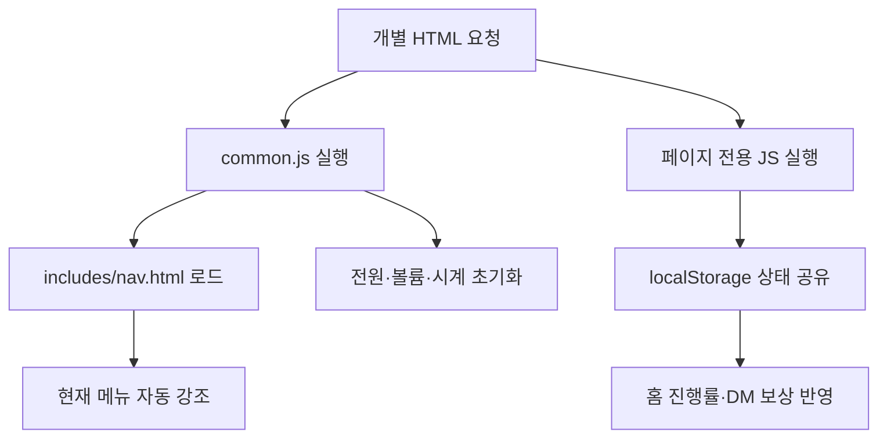

# 📱 기훈의 갤럭시 - 개인 포트폴리오 웹 기획서 (최종판)

이 프로젝트는 SSAFY 캠퍼스 생활 중 동료들과의 자연스러운 네트워킹과 스터디 모집을 목적으로 제작된 **갤럭시 One UI 및 인스타그램 인터페이스 기반의 인터랙티브 웹 포트폴리오**입니다. 

홈, DM, 스터디, 추천 화면을 각각 독립된 HTML 문서로 분리하고, 공통 네비게이션은 별도의 `nav.html` 파일에서 관리합니다. 게이미피케이션, 디바이스 하드웨어 가상화, 통합 암전 제어, 다이내믹 펀치홀 알림을 결합하여 실제 모바일 기기를 조작하는 경험을 구현했습니다.


---

## 🛠️ 1. 개발 및 수정 기록 (Changelog)

### [2026-07-13] v2.0 - SPA에서 MPA로 전환 및 공통 네비게이션 분리

* **[MPA 전환]** 단일 HTML에 포함돼 있던 홈, DM, 스터디, 추천 섹션을 `index.html`, `dm.html`, `study.html`, `recommendations.html`로 분리했습니다.
* **[페이지 이동 방식 변경]** `data-target`과 섹션 활성화 클래스를 이용하던 SPA 탭 전환을 제거하고, `<a href>`를 통한 독립 문서 이동 방식으로 변경했습니다.
* **[공통 네비게이션 분리]** 하단 갤럭시 독을 `html/includes/nav.html`에 별도 저장하고, 모든 페이지의 `navigation-container`에 `common.js`가 `fetch()`로 삽입하도록 변경했습니다.
* **[현재 페이지 자동 표시]** `common.js`가 현재 URL의 파일명과 각 메뉴의 `href`를 비교하여 해당 메뉴에 `active`와 `aria-current="page"`를 자동 적용합니다.
* **[JavaScript 책임 분리]** 기존 `app.js`를 `common.js`, `home.js`, `dm.js`, `recommendations.js`로 분리했습니다. 스터디 페이지는 공통 기능만 사용하므로 `common.js`만 로드합니다.
* **[페이지 간 상태 유지]** 추천 페이지에서 수집한 아이템을 `localStorage`에 저장하고, 홈과 DM 페이지가 같은 키를 읽어 진행률 및 히든 답변 조건을 복원하도록 구성했습니다.
* **[MPA 링크 스타일 보정]** 내비게이션 요소가 `<button>`에서 `<a>`로 변경되면서 발생하는 밑줄과 글꼴 차이를 `text-decoration: none`, `font: inherit`으로 제거했습니다.
* **[실행 환경 명시]** 공통 `nav.html`을 `fetch()`로 불러오기 때문에 `file://` 직접 실행은 지원하지 않으며, Live Server 또는 HTTP/HTTPS 배포 환경에서 실행하도록 기준을 확정했습니다.

### [2026-07-10] v1.3 - 디바이스 전체 스크린 암전 및 가드 시스템 최적화
* **[통합 디스플레이 암전]** 전원 버튼 조작 시 상단 바와 메인 스크린, 하단 독 메뉴까지 액정 전체가 한 번에 소멸하는 가상 블랙아웃 레이어(`::after`)를 CSS 아키텍처에 추가했습니다.
* **[네비게이션 가드]** 디바이스 전원이 꺼진 상태(`power-off`)에서는 하단 내비게이션 독 탭 및 내부 요소의 모든 클릭·터치 이벤트(`pointer-events: all`)를 차단하는 런타임 예외 처리를 반영했습니다.

### [2026-07-10] v1.2 - 하드웨어 디바이스 리뉴얼 및 부팅 시스템 추가
* **[디바이스 하드웨어 구현]** 외부 물리 버튼(좌측 볼륨 업/다운, 우측 전원 버튼) 및 전면 상단 인피니티-O 카메라 펀치홀 섬 디테일을 레이어링했습니다.
* **[시네마틱 부팅 연출]** 전원이 켜질 때 브라이트니스 필터와 블러(`blur`) 효과가 서서히 걷히며 화면이 깨어나는 `bootDevice` 페이드인 애니메이션을 적용했습니다.

### [2026-07-10] v1.1 - 추천 피드 전환 및 수집 시스템 도입
* **[콘텐츠 전환]** 기존 앱 섹션을 개발자의 인사이트를 공유하는 **'내가 하는 추천(⭐)' 피드**로 전면 리뉴얼했습니다.
* **[게이미피케이션]** 추천 피드 내 슬라이더 이미지 속에 개발자의 핵심 아이덴티티 아이템(☕, 🏋️‍♂️)을 숨겨두고 탐색·수집하는 이스터에그 엔진을 도입했습니다.

---

## 🎯 2. 주요 기능 명세 (Core Features)

### ① 🎬 하드웨어 시뮬레이터 및 통합 전원/볼륨 제어
* **가상 하드웨어 단추:** 폰 프레임 좌우측에 입체적인 물리 버튼을 디자인하고 이벤트를 바인딩하여, 실제 볼륨 바 UI가 스크린 측면에 가볍게 나타났다 사라지는 인터랙션을 구현했습니다.
* **전체 디스플레이 암전:** 전원 버튼 클릭 시 `.phone-container` 최상단에 검은색 암전 가상 레이어(`z-index: 99999`)를 즉각 로드하여 액정이 통째로 꺼지는 연출을 완수했습니다.
* **실시간 상단 바 동기화:** JavaScript `Date` 객체를 통한 리얼타임 시계 반영 및 내장 배터리 API(`navigator.getBattery()`)를 연동하여 사용자의 실제 디바이스 배터리 잔량과 충전 상태(⚡)를 상단 바 UI에 연동했습니다.

### ② 📸 다이내믹 펀치홀 알림 엔진 (Dynamic Island UX)
* 전면 카메라 펀치홀 섬(`.camera-island`) 영역을 동적으로 활용합니다. 이스터에그 수집 성공 또는 시스템 초기화 시 카메라 홀이 가로로 늘어나며 유저에게 컴팩트한 알림 메시지를 송출하고 다시 본래의 홀 형태로 수축하는 애니메이션을 제공합니다.

### ③ SPA 기반 갤럭시 독(Dock) 내비게이션
* 하단 탭 버튼 클릭 시 화면 새로고침 없이 각 앱 섹션(`홈`, `인스타DM`, `스터디`, `추천`)으로 부드럽게 스위칭되는 단일 페이지 애플리케이션(SPA) 구조를 채택했습니다.

### ④ 🕹️ 이스터에그 수집 엔진 (Gamification)
* **실시간 대시보드 동기화:** 조각 수집 시 아이템은 화면에서 즉시 소멸(`scale(0)`)하며, 홈 화면 대시보드의 프로그레스 바가 실시간으로 동기화됩니다.
* **지속성 및 초기화:** `localStorage`를 활용하여 페이지 리로드 시에도 수집 상태가 온전히 보존되며, 초기화 엔진을 통해 전체 리셋 및 펀치홀 알림 피드백을 전달합니다.
* **히든 보상 연계:** 올클리어 후 인스타DM 창에서 특정 암호 키워드(`오운완`, `아메리카노`) 전송 시 전용 리액션 대화 플로우가 활성화됩니다.
  
### ⑤ 💬 인스타그램 DM 대화 시스템

* 전송 버튼 또는 Enter 키로 메시지를 입력하며, 사용자 메시지와 상대방 메시지를 서로 다른 말풍선으로 표시합니다.
* 자기소개, 나이, 음식 등 등록된 키워드에 따라 정해진 답변을 반환하고, 일치하는 키워드가 없으면 기본 답변 중 하나를 무작위로 선택합니다.
* 답변 객체의 `image` 속성에 이미지 경로를 지정하면 텍스트와 이미지를 하나의 DM 말풍선에 함께 출력합니다.
* 이미지 확장자와 실제 파일명이 일치해야 하며, 현재 프로젝트 구조에서는 `../static/파일명` 형식의 상대경로를 사용합니다.

---

## 📐 3. 시스템 아키텍처 및 UI 데이터 흐름



페이지별 실행 흐름은 다음과 같습니다.

```text
index.html
 ├─ common.js: 공통 네비게이션, 전원, 볼륨, 시계, 배터리
 └─ home.js: 수집 현황 표시 및 초기화

dm.html
 ├─ common.js: 공통 네비게이션, 전원, 볼륨, 시계, 배터리
 └─ dm.js: 메시지 전송, 키워드 답변, 이미지 답변, 히든 보상

study.html
 └─ common.js: 공통 네비게이션, 전원, 볼륨, 시계, 배터리

recommendations.html
 ├─ common.js: 공통 네비게이션, 전원, 볼륨, 시계, 배터리
 └─ recommendations.js: 이미지 슬라이더, 아이템 수집, 완료 모달
```

---

## 🎨 4. 컴포넌트 구조 및 스타일 가이드 (CSS Architecture)

* **변수 풀 관리:** `:root`에서 갤럭시 다크모드 색상, 패널 색상, 강조 색상, 보조 텍스트 색상을 전역 변수로 관리합니다.
* **공통 스타일 유지:** 모든 HTML이 하나의 `../css/style.css`를 불러와 폰트, 색상, 여백, 디바이스 프레임을 동일하게 유지합니다.
* **공통 네비게이션 레이아웃:** `.navigation-container`에 `flex-shrink: 0`을 지정하여 비동기로 삽입된 하단 메뉴가 축소되지 않도록 처리합니다.
* **링크 기본 스타일 제거:** `.nav-item`에 `text-decoration: none`과 `font: inherit`을 지정하여 `<a>` 요소의 브라우저 기본 스타일을 제거합니다.
* **암전 캡슐화:** 부모 컨테이너의 `::after` 가상 요소 하나로 화면 전체를 덮어 개별 UI 요소마다 숨김 상태를 적용하지 않습니다.
* **이벤트 버블링 제어:** 이스터에그 클릭 시 `stopPropagation()`을 호출하여 이미지 드래그 이벤트와 충돌하지 않도록 처리합니다.

---

## 🗂️ 5. 최종 디렉터리 구조 및 실행 환경

```text
project/
├── html/
│   ├── includes/
│   │   └── nav.html
│   ├── index.html
│   ├── dm.html
│   ├── study.html
│   └── recommendations.html
├── css/
│   └── style.css
├── js/
│   ├── common.js
│   ├── home.js
│   ├── dm.js
│   └── recommendations.js
└── static/
    ├── bakery1_1.jpg
    ├── bakery1_2.jpg
    ├── bakery1_3.jpg
    ├── bakery1_4.jpg
    ├── hobby_1.jpeg
    └── hobby_2.jpeg
```

### 로컬 실행

`nav.html`을 `fetch()`로 불러오므로 HTML 파일을 더블클릭하여 `file://`로 실행하면 브라우저 CORS 정책에 의해 차단됩니다. VS Code Live Server 또는 다음 명령으로 HTTP 서버를 실행해야 합니다.

```bash
python -m http.server 5500
```

```text
http://localhost:5500/html/index.html
```

### 배포 환경

Netlify, Vercel 등 HTTP/HTTPS 기반 정적 호스팅에서는 디렉터리 구조가 유지되면 정상 작동합니다. 배포 후 `/html/includes/nav.html` 주소가 응답하는지 확인해야 하며, 모든 요청을 하나의 HTML로 보내는 SPA fallback 설정은 적용하지 않습니다.

---
